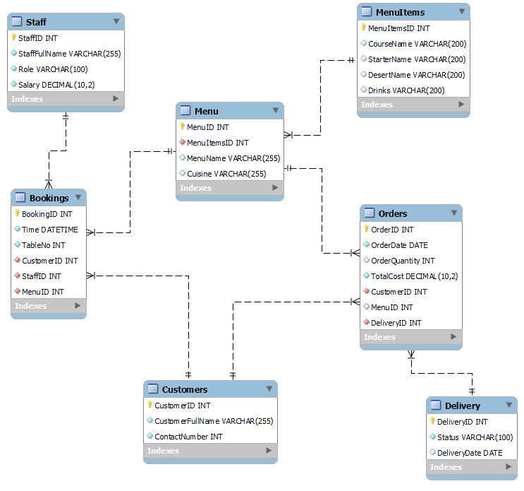
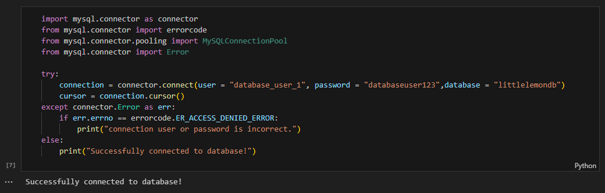
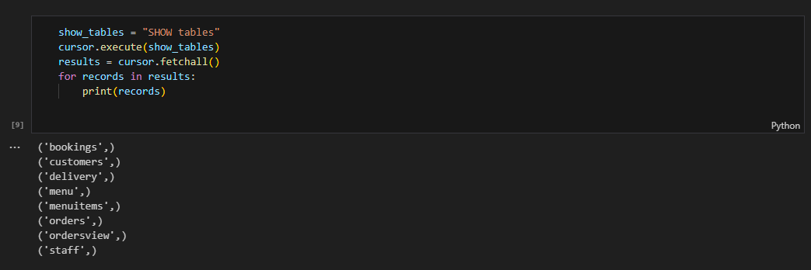
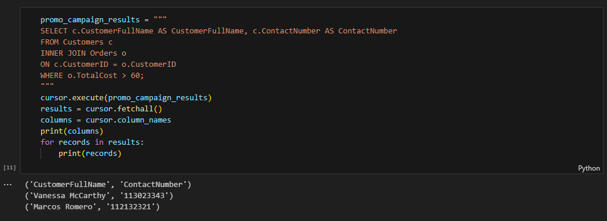
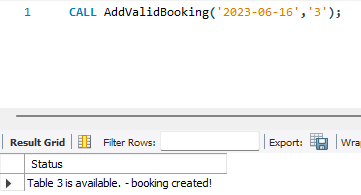
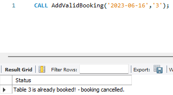
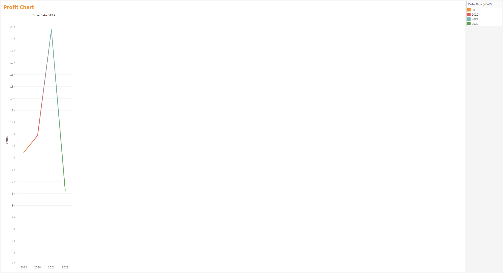
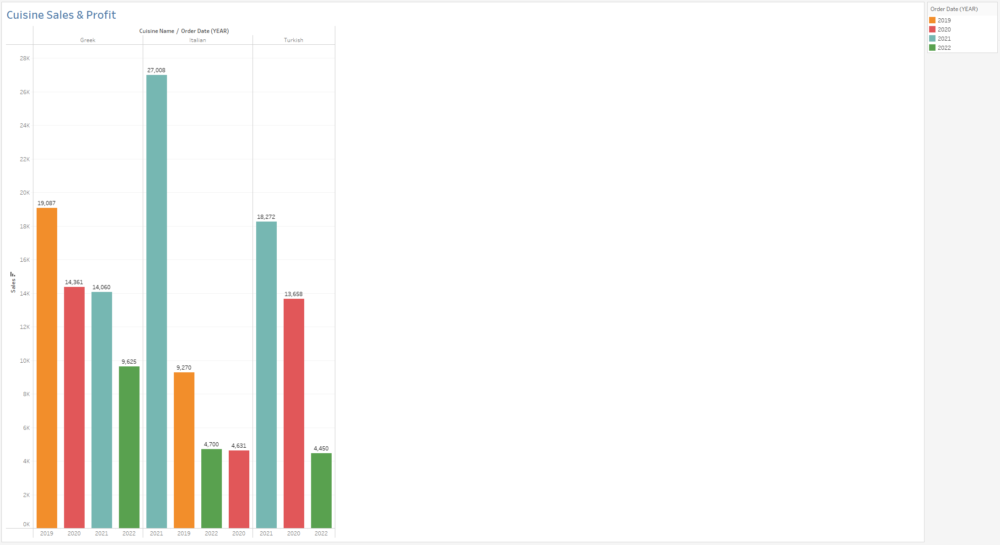

# Welcome to my Data Engineering Project!  
This project will be all about showcasing what I've learned from my course in Data Engineering. I will be building a data model, forwarding that model into an actual database, manipulate and insert data into the database using Python, created data pipelines, and finally showcasing the results in a presentable way using Tableau. 
---------------------------------------------------------------------------------------------------------
I started off this project created the data model using MySQL Workbench. I went with a entity-relationship diagram. 

After successfully creating the diagram, I used the forward engineer tool that MySQL Workbench provides, and created the database for the Little Lemon store. I populated the database with random information gathered from a excel file using simple import syntax. 

With the database created and tables populated, now it was time to create pipelines using Python. With python, I imported the neccessary libraries and tried to initiate a connection to the database. 

With that successful, now I want to test the connection. I did a simple syntax to show me all tables that exist in the database.

One last test with the connection to verify it truly working was to now perform a little more complicated syntax. Little Lemon wanted to retrieve all customers along with their phone numbers who spent more than $60 during their last promo. I executed this using Python again with the connection. 

---------------------------------------------------------------------------------------------------------
With the connection truly working, now I wanted to test some SQL scripts. I made various procedures that would help expedite a lot of things. 

When it comes to inputing information into a database, time and efficiency is key, with procedures I can help a business perform the task of inputing valuable information easier and faster. For example, when a customer asked to be booked in the Little Lemon store, the procedure "AddValidBooking" would check if a booking is valid, and depending on the result, it will display if the booking is created or if the booking is cancelled.

Booking Created would be:

This created the booking successfully because table 3 on that date was not booked yet. 

If I tried booking that table on the same date again, then this would result in:

This is just an example of the many procedures I've created to help the business be more efficient. 
---------------------------------------------------------------------------------------------------------
Now with the database in good standing, it was time to create an analysis of sales and profits to help answer some questions that the business 'Little Lemon' needed answered. To do this I used Tableau, an excellent program to create dashboards and help businesses read data in a very easy way. 

Little Lemon wanted to see their profit trend over the years so I gathered the data from the MySQL database and imported it into Tableau. From there, I created a line graph that showed the trend over the years. 

Little Lemon also wanted to know which type of cuisine was selling the most, with this I created a bar chart, with the different types of cuisines and their sales over the years. The higher the bar, the more that specific cuisine sold. 

---------------------------------------------------------------------------------------------------------
In conclusion, I hope you saw what kind of skills I possess. I created a database from scartch, populated it with tables, data, and procedures, created a connection using Python, and made Tableau sheets analyzing all of the data to answer questions that the business have. Thank you for taking the time to look through my project!  

